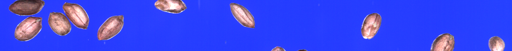
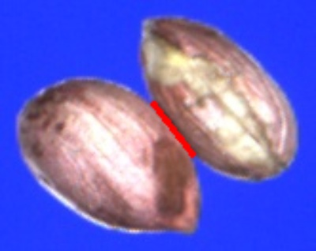
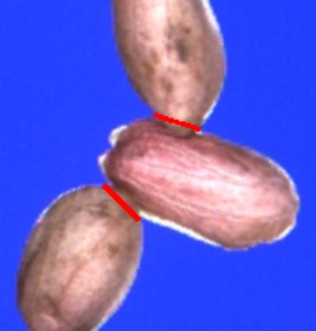

# 目录结构
`instance_result`运行结果裁剪图。

`origin_img`原始图像，蓝色背景。

`run_video`运行演示视频，统计单位为us，展示视频时代码使用：`cv::waitKey(100);`延时。
# 原始图像示例

# 运行结果示例

# 展示视频

见

# 性能
见[详细](https://www.2light.top/project-detail.html?project_id=6)

# 如何获取
**暂不开源**
